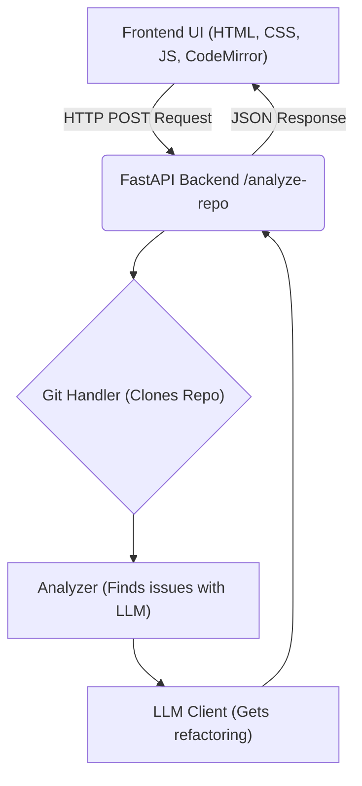

# CodeCrucible


This is a full-stack application that acts as an AI-powered pair programmer. You can give it a whole GitHub repository or just a single function, and it will provide intelligent suggestions for improvement across multiple languages.


---
## Demo
[](https://codecrucible.onrender.com/)


## Overview

RefactorGen is a tool designed to meet the modern demands of software development. It goes beyond simple linting by leveraging a powerful Large Language Model (LLM) to perform a deep semantic analysis of codebases. It can identify complex issues—from security vulnerabilities to algorithmic inefficiencies—and provide actionable, refactored code suggestions in a clean, interactive user interface.

This project was built to explore the challenges of creating a reliable, multi-language AI assistant, focusing on a robust backend API and a polished user experience.

## Features

* **Multi-Language Code Analysis:** Analyzes code in Python, Java, C++, JavaScript, HTML, and CSS using a flexible, LLM-based approach.
* **AI-Powered Refactoring:** Identifies code smells and vulnerabilities and provides intelligent, refactored code snippets with clear explanations.
* **Algorithmic Optimization:** Got a brute-force function? Paste it into the optimizer. It will analyze the time and space complexity and provide a more efficient, time-optimized solution with a full Big O analysis.
* **Interactive Web UI:** A clean, modern frontend built with vanilla HTML/CSS/JS that includes:
    * **CodeMirror Editors:** For professional-grade code input and syntax highlighting.
    * **"Before & After" View:** A side-by-side comparison of the original and refactored code.
* **RESTful API Backend:** Built with FastAPI, providing a scalable and well-documented service.
* **Robust Git Repository Handling:** Efficiently clones repositories using shallow clones and skips large files to ensure fast analysis.

## Architecture

The project is a full-stack application with a clear separation between the backend service and the frontend interface.



* **Frontend:** A static single-page application located in the `/static` directory.
* **Backend API (`/api`):** A FastAPI server that orchestrates the analysis.
* **Core Logic (`/core`):** A modular library containing the logic for Git operations, code analysis, and LLM communication.

---

## Setup and Installation

Follow these steps to run the project locally.

1.  **Clone the repository:**
    ```bash
    git clone [https://github.com/your-username/your-repo-name.git](https://github.com/your-username/your-repo-name.git)
    cd your-repo-name
    ```

2.  **Create and activate a virtual environment:**
    ```bash
    python3 -m venv project_env
    source project_env/bin/activate
    ```

3.  **Install the dependencies:**
    ```bash
    pip install -r requirements.txt
    ```

4.  **Create a `.env` file** in the project root and add your LLM API key:
    ```
    API_KEY=your_llm_api_key_here
    ```

5.  **Run the API server:**
    ```bash
    uvicorn api.main_api:app
    ```

---

## Usage

1.  Once the server is running, open your browser and navigate to **`http://127.0.0.1:8000`**.
2.  **To analyze a repository:**
    * Enter a public GitHub repository URL into the first input field.
    * Click "Analyze Repository."
3.  **To optimize a code snippet:**
    * Paste a code into the code editor.
    * Click "Optimize Code."

---


